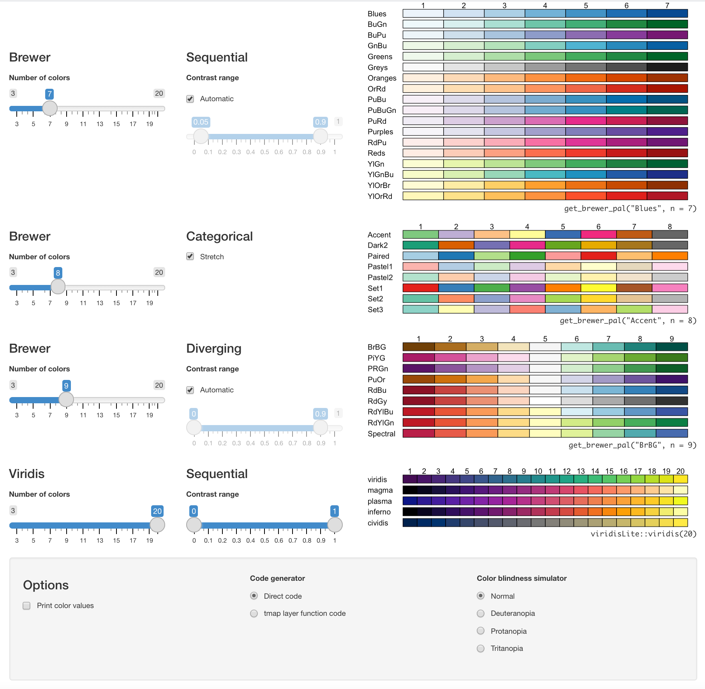

<!--more-->

```{r setup, include=FALSE}
knitr::opts_chunk$set(echo = TRUE, 
                      fig.path = "static",
                      fig.height=6, fig.width=6, 
                      message=FALSE, warning=FALSE)

```


I had super fun exploring the [tmap](https://cran.r-project.org/web/packages/tmap/index.html) package functionality while preparing a presentation about geospatial visualization for the [Abuja R-Ladies/R Users meetup](https://ramikrispin.github.io/gis-dataviz-workshop/#1), so I decided to write a short tutorial about it. 

The **tmap** package provides a set of functions and tools for creating thematic maps such as choropleths and bubble maps. The package follows the **ggplot2** syntax style enabling users to add different layers to the map. By default, the plot output is static, but it also has an interactive mode providing a wrapper to the JavaScript [leaflet](https://leafletjs.com/) library (similar to **mapview** and **leaflet** packages). This tutorial focuses on the basic functionality of the package covering:

* Plotting `sf` objects
* Customize the plot colors
* Setting titles and legends
* Global options and attributes


```{r message=FALSE, warning=FALSE, include=FALSE}
suppressMessages(sf::sf_use_s2(FALSE))
```


```{r echo=FALSE, message=FALSE, warning=FALSE, include=TRUE}
library(tmap)
library(sf)
library(covid19sf)
library(dplyr)

data(covid19sf_vaccine_geo)


df <- covid19sf_vaccine_geo %>% filter(area_type == "Analysis Neighborhood") %>%
  mutate(perc_complated = percent_pop_series_completed * 100)


tm_shape(df) + 
  tm_polygons("perc_complated",
              palette = "RdYlBu",
              title = "% Group") +
  tm_style("cobalt") +
  tm_text(text = "id", 
          size = 0.6) +
  tm_layout(title = "COVID-19 Vaccines Given to San Franciscans by Geography",
            legend.position =c("right", "bottom"),
            legend.outside = FALSE,
            legend.title.size = 1.2,
            legend.text.size = 0.9, 
            inner.margins = c(0.01, 0.01, .12, .25))
```


#### Libraries

In this tutorial, we will use the following libraries:

- **tmap** - tools and functions for creating thematic maps
- **sf** - supports for `sf` objects
- **covid19sf** - daily summary of COVID-19 cases and vaccination status in San Francisco
- **dplyr** - to manipulate and filter the data
- **RColorBrewer** - to set a color palettes for the plot

```{r}
library(tmap)
library(sf)
library(covid19sf)
library(dplyr)
library(RColorBrewer)
```

#### Data input

The **tmap** package supports objects from the **sf**,  **stars**, **sp**, and **raster** packages. I generally find it easier to work with `sf` object as it is a `data.frame` with extra attributes (nested geometry data). Therefore, it is significantly easier and faster to manipulate `sf` objects with the use of **dplyr** or similar applications.  

In the examples below, we will use  the `covid19sf_vaccine_geo` dataset from the [covid19sf](https://github.com/RamiKrispin/covid19sf) package. This dataset represents the COVID-19 vaccinations given to SF residents by geographic region of their residential address. The dataset comes as an `sf` object, therefore, no additional reformatting is needed: 

```{r}
data(covid19sf_vaccine_geo)

head(covid19sf_vaccine_geo)
```

The dataset includes the following fields:

* `id` - Area id
* `area_type` - Area type, c("Analysis Neighborhood", "Summary")
* `count_vaccinated_by_dph` - Count of residents in the given geographic region who has received at least one dose administered by DPH
* `count_vaccinated` - Count of residents in the given geographic region who has received at least one dose regardless of who administered the vaccine
* `count_series_completed` - Count of residents in the given geographic region who has completed a vaccine series
* `acs_population` - 2019 5-year American Community Survey population estimate for the given geographic region (all ages)
* `percent_pop_series_completed` - The total count of population that has completed a vaccine series by population estimate (acs_population)
* `last_updated` - Last update of the data in POSIXc format)
* `geometry` - The area polygon data

In the examples below, we will plot the percentage of San Francisco's fully vaccinated population by neighborhood. The dataset contains both neighborhood and aggregated level data. Therefore, before starting, we will filter the data by the neighborhood level and remove the aggregated data:

```{r}
df <- covid19sf_vaccine_geo %>% 
  filter(area_type == "Analysis Neighborhood") %>%
  mutate(perc_complated = percent_pop_series_completed * 100)
```

**Note:** We created the `perc_complated` variable, a transformation of the `percent_pop_series_completed` variable from decimal to percentage format.


#### Basic map

Before starting, following changes in the default options of the sf package from version `1.0-1`, the default option is to use s2 spherical geometry when coordinates are ellipsoidal. That can cause some issues with the **tmap** package, therefore we will set this functionality as `FALSE`:

```{r}
sf_use_s2(FALSE)
```

We will start with a basic plot of the percentage of the vaccinated population in San Francisco. The `tm_shape` function specifies the shape object, and the `tm_polygons` function draws the polygons and fills the color based on the input variable:

```{r}
tm_shape(df) + 
  tm_polygons(col = "perc_complated",
              title = "% Group")
```


By default, the `tm_polygons` function bucket the continues variable into groups. In the case above, the percentage of vaccinated population, into groups of tens. The `style` and `n` arguments enable you to control the splitting or bucketing method (e.g., by fixed breaks, standard divination, quantile, log scale, etc.) and the number of groups, respectively. For example, let's use the `equal` style and set the percentage groups into 10 equal buckets:

```{r }
tm_shape(df) + 
  tm_polygons("perc_complated",
              n = 10,
              style = "equal",
              title = "% Group")  
```


#### Color setting

Let's now modify the plot's colors. The `palette` argument on `tm_polygons` function enables you to define the map fill color palette. For example, we will use the `RdYlBu` from the **RColorBrewer** package:


```{r fig.height=3}
display.brewer.pal(n=7, name = "RdYlBu")
```


```{r}
tm_shape(df) + 
  tm_polygons("perc_complated",
              palette = "RdYlBu",
              title = "% Group")  
```

The `palette` argument supports R's main color palettes packages, such as **RColorBrewer** and **viridis**. You can customize and modify the default palettes with the `palette_explorer` function, a Shiny app from the **tmaptools** package:

```r
library(tmaptools)

palette_explorer()
```





The `tm_layout` function enables setting and modifying the plot's main elements: title, margins, aspect ratio, colors, frame, legend, etc. In the following example, we will modify the previous plot and set the background to black using the `bg.color` argument. As the default text color is black, we will modify the legend title color to white with the `attr.color` argument: 


```{r}
tm_shape(df) + 
  tm_polygons("perc_complated",
              palette = "RdYlBu",
              title = "% Group") +
  tm_layout(bg.color = "black",
            attr.color = "white")
```

An alternative approach for setting the plot colors is to use a built-in color style. The `tm_style` function provides a predefined styles. That includes the following styles:

* `white` -	White background, commonly used colors (default)
* `gray`/`grey` -	Grey background, useful to highlight sequential palettes (e.g. in choropleths)
* `natural` -	Emulation of natural view: blue waters and green land
* `bw` -	Greyscale, obviously useful for greyscale printing
* `classic` -	Classic styled maps (recommended)
* `cobalt` -	Inspired by latex beamer style cobalt
* `albatross` -	Inspired by latex beamer style albatross
* `beaver` -	Inspired by latex beamer style beaver


For example, let's use the `cobalt` style:

```{r}
tm_shape(df) + 
  tm_polygons("perc_complated",
              palette = "RdYlBu",
              title = "% Group") +
  tm_style("cobalt")
```


#### Titles and legends

After we set the color theme it is time to set the plot title and customize the legend with the `tm_layout` function. We will use the function `title` argument (not to be confused with the `title` argument of the `tm_polygons` function):


```{r}
tm_shape(df) + 
  tm_polygons("perc_complated",
              palette = "RdYlBu",
              title = "% Group") +
  tm_style("cobalt") +
  tm_layout(title = "COVID-19 Vaccines Given to San Franciscans by Geography")
```

**Note:** You can customize the title position with the `title.position` argument, using a vector of two values (see `?title.position` for more details).

It may make sense to move the plot's legend to the bottom right. We will use the following legend arguments: 

* `legend.position` - to set the legend position
* `legend.outside` - if set to `TRUE`, will position the legend outside the plot margin
* `legend.title.size` - set the legend title font size
* `legend.text.size` - set the legend font size


```{r}
tm_shape(df) + 
  tm_polygons("perc_complated",
              palette = "RdYlBu",
              title = "% Group") +
  tm_style("cobalt") +
  tm_layout(title = "COVID-19 Vaccines Given to San Franciscans by Geography",
            legend.position =c("right", "bottom"),
            legend.outside = FALSE,
            legend.title.size = 1.2,
            legend.text.size = 0.9)
```

You can note that both the title and legend have some overlapping with the plot itself. We will use the `inner.margins` argument to modify the plot margins. This argument is a vector of four values specifying the bottom, left, top, and right margin:


```{r}
tm_shape(df) + 
  tm_polygons("perc_complated",
              palette = "RdYlBu",
              title = "% Group") +
  tm_style("cobalt") +
  tm_layout(title = "COVID-19 Vaccines Given to San Franciscans by Geography",
            legend.position =c("right", "bottom"),
            legend.outside = FALSE,
            legend.title.size = 1.2,
            legend.text.size = 0.9, 
            inner.margins = c(0.01, 0.01, .12, .25))
```

Next, we will label the polygons with their names with the `tm_text` function. The `text` and `size` arguments define the labels variable and the font size, respectively:

```{r}
tm_shape(df) + 
  tm_polygons("perc_complated",
              palette = "RdYlBu",
              title = "% Group") +
  tm_style("cobalt") +
  tm_text(text = "id", 
          size = 0.6) +
  tm_layout(title = "COVID-19 Vaccines Given to San Franciscans by Geography",
            legend.position =c("right", "bottom"),
            legend.outside = FALSE,
            legend.title.size = 1.2,
            legend.text.size = 0.9, 
            inner.margins = c(0.01, 0.01, .12, .25))
```


#### Plot attributes

Last but not least, we will review the **tmap** package global options. The `tmap_options` function defines the default global attributes of the plot:

```{r}
head(tmap_options(), 10)
```

In total, there are 111 attributes:

```{r}
names(tmap_options())
```

For example, we can check the default plot background and text color as we set above with the `bg.color` and `attr.color`:

```{r}
tmap_options()$bg.color

tmap_options()$attr.color

tmap_options()$style
```

Here is a nice example, from the `tmap_options` documentation, of setting a black style option (for more examples, see `?tmap_options`). First, we will define the key elements of the plot color schema as a list:

```{r}
black_style  <- structure(
    list(
		bg.color = "black",
		aes.color = c(fill = "grey40", borders = "grey40", 
					  symbols = "grey80", dots = "grey80", 
		              lines = "white", text = "white", 
					  na = "grey30", null = "grey15"),
		aes.palette = list(seq = "plasma", div = "PiYG", cat = "Dark2"),
		attr.color = "white",
		panel.label.color = "white",
		panel.label.bg.color = "grey40",
		main.title.color = "white",
		inner.margins = c(0.01, 0.01, .12, .25),
		legend.text.size = 0.9,
		legend.title.size = 1.2,
		legend.outside = FALSE
	),
	style = "black"
)
```

Using the `tmap_options` function, we will assign the new style to the global options:

```{r}
tmap_options(black_style)
```

You can confirm that the default option for `bg.color` is now black:

```{r}
tmap_options()$bg.color
```

After we updated the global options, let's replot the map:

```{r}
tm_shape(df) + 
  tm_polygons("perc_complated",
              palette = "RdYlBu",
              title = "% Group") +
   tm_text(text = "id", 
          size = 0.6) +
  tm_layout(title = "COVID-19 Vaccines Given to San Franciscans by Geography",
            legend.position =c("right", "bottom"))
```

#### Additional resources

Below are some additional resources and documentation:

* **tmap** package:
  - Documentation - https://cran.r-project.org/web/packages/tmap/index.html
  - Github - https://github.com/r-tmap/tmap
* **covid19sf** package:
  - Documentation - https://ramikrispin.github.io/covid19sf/
  - Gibhub - https://github.com/RamiKrispin/covid19sf
  - Geospatial Visualization of the Covid19 Cases - https://ramikrispin.github.io/covid19sf/articles/geo.html
* **sf** package:
  - Documentation - https://r-spatial.github.io/sf/
  - Gibhub - https://github.com/r-spatial/sf